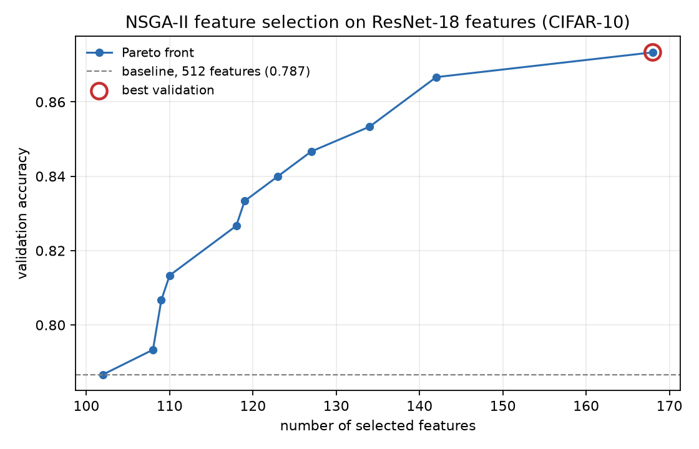

# nsga2-deep-feature-selection

Using NSGA-II to pick a small subset of ResNet-18 features that still
classifies CIFAR-10 as well as the full 512.

Short answer: 168 features get the same test accuracy as all 512.

## The idea

A pretrained CNN turns each image into a vector of numbers. ResNet-18 gives
512 of them. Not all of them are useful for a particular task, and with a
distance based classifier like k-NN the useless ones actively hurt, since
every one of them adds noise to every distance you compute.

So which ones do you keep?

Each feature is either in or out, so there are 2^512 possible subsets. You
cannot check them all, and you cannot use gradients either, because there is
no such thing as "a bit more of feature 47". What is left is search.

NSGA-II searches with two goals at once:

- get the accuracy as high as possible
- keep as few features as possible

Those two pull against each other, so there is no single winner. The answer
is a Pareto front: a set of solutions where each one wins on something.

## Setup

| | |
|---|---|
| Data | 1000 CIFAR-10 images, 100 from each class |
| Split | 700 train / 150 validation / 150 test, stratified |
| Features | ResNet-18 with the classifier layer removed, 512 dimensions |
| Classifier | k-NN, k = 5, the same for every candidate |
| Search | NSGA-II from DEAP, population 100, 50 generations |
| Encoding | one bit per feature, 1 means keep it |
| Operators | uniform crossover 0.9, bit flip mutation 1/512 |

Images are resized to 224x224 and normalised with ImageNet statistics, since
that is what ResNet-18 expects. The scaler is fit on the training split only.
The test set is not loaded at any point during the search.

## Results

| | features | validation | test |
|---|---:|---:|---:|
| all features | 512 | 0.7867 | 0.7267 |
| best from NSGA-II | 168 | 0.8733 | 0.7267 |

Same test accuracy, a third of the features.

The full front:

| features | validation accuracy |
|---:|---:|
| 102 | 0.7867 |
| 108 | 0.7933 |
| 109 | 0.8067 |
| 110 | 0.8133 |
| 118 | 0.8267 |
| 119 | 0.8333 |
| 123 | 0.8400 |
| 127 | 0.8467 |
| 134 | 0.8533 |
| 142 | 0.8667 |
| 168 | 0.8733 |



## About that validation number

Validation says 0.8733 and test says 0.7267. The gap is not an improvement
that failed to show up. It is something the search created.

NSGA-II scores a few thousand subsets against the same 150 validation images
and keeps whichever scores highest. With only 150 images, an accuracy estimate
wobbles by around 3 percent just from which images happened to land in that
split. Try thousands of subsets against a wobbly measurement and one of them
will look great partly by luck, and the search has no way to tell luck from
skill.

So the validation column is optimistic by construction. Test is the number to
read, and the conclusion above is based on it.

## Running it

```
pip install -r requirements.txt

python extract_features.py
python baseline.py
python nsga2.py
python report.py
```

The first script downloads CIFAR-10 and the ResNet-18 weights, which takes a
few minutes the first time. Feature extraction is a few minutes more on CPU.
The search takes around 20 minutes.

Seeds are fixed, so the numbers above come out the same every run.

## License

MIT
