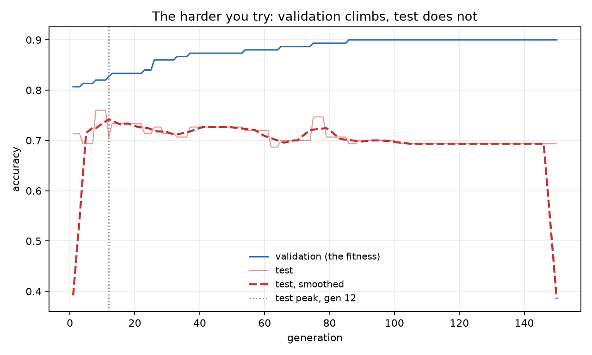
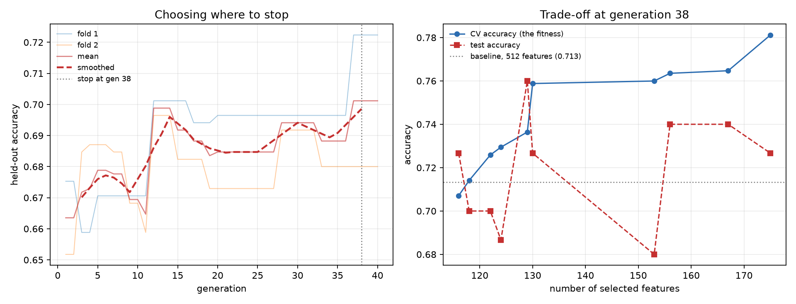

# nsga2-deep-feature-selection

Using NSGA-II to pick a small subset of ResNet-18 features that still
classifies CIFAR-10 as well as the full 512.

Short answer: 168 features get the same test accuracy as all 512.

## The idea

A pretrained CNN turns each image into a vector of numbers. ResNet-18 gives
512 of them. Not all of them are useful for a particular task, and with a
distance based classifier like k-NN the useless ones actively hurt, since
every one of them adds noise to every distance you compute.

So which ones do you keep?

Each feature is either in or out, so there are 2^512 possible subsets. You
cannot check them all, and you cannot use gradients either, because there is
no such thing as "a bit more of feature 47". What is left is search.

NSGA-II searches with two goals at once:

- get the accuracy as high as possible
- keep as few features as possible

Those two pull against each other, so there is no single winner. The answer
is a Pareto front: a set of solutions where each one wins on something.

## Setup

| | |
|---|---|
| Data | 1000 CIFAR-10 images, 100 from each class |
| Split | 700 train / 150 validation / 150 test, stratified |
| Features | ResNet-18 with the classifier layer removed, 512 dimensions |
| Classifier | k-NN, k = 5, the same for every candidate |
| Search | NSGA-II from DEAP, population 100, 50 generations |
| Encoding | one bit per feature, 1 means keep it |
| Operators | uniform crossover, p = 0.9 per pair and 0.5 per bit; mutation, p = 0.1 per offspring and 1/512 per bit |

Images are resized to 224x224 and normalised with ImageNet statistics, since
that is what ResNet-18 expects. The scaler is fit on the training split only.
The test set is not loaded at any point during the search.

## Results

| | features | validation | test |
|---|---:|---:|---:|
| all features | 512 | 0.7867 | 0.7267 |
| best from NSGA-II | 168 | 0.8733 | 0.7267 |

Same test accuracy, a third of the features.

The full front:

| features | validation accuracy |
|---:|---:|
| 102 | 0.7867 |
| 108 | 0.7933 |
| 109 | 0.8067 |
| 110 | 0.8133 |
| 118 | 0.8267 |
| 119 | 0.8333 |
| 123 | 0.8400 |
| 127 | 0.8467 |
| 134 | 0.8533 |
| 142 | 0.8667 |
| 168 | 0.8733 |


## About that validation number

Validation says 0.8733 and test says 0.7267. The gap is not an improvement
that failed to show up. It is something the search created.

NSGA-II scores a few thousand subsets against the same 150 validation images
and keeps whichever scores highest. With only 150 images, an accuracy estimate
wobbles by around 3 percentage points just from which images happened to land
in that split. Try thousands of subsets against a wobbly measurement and one of them
will look great partly by luck, and the search has no way to tell luck from
skill.

So the validation column is optimistic by construction. Test is the number to
read, and the conclusion above is based on it.

## Going further: does the search actually find anything?

The result above bothered me. Validation said 0.8733, test said 0.7267, and the
baseline test was also 0.7267. So the front looked good and the honest number
had not moved at all.

That raises a simple question. If NSGA-II picks 168 features and gets 0.7267,
what do 168 *random* features get?

About the same. Across four seeds the advantage over random subsets of the
same size was under one standard deviation of the random draws. The subsets
chosen by different seeds also overlapped at roughly chance level, and the
union of three different subsets scored higher than any of them individually.

Three separate signals pointing the same way: at this subset size, almost any
selection works, so no method can look good against random.

### What the literature says

The relevant paper is Loughrey and Cunningham, *Overfitting in Wrapper-Based
Feature Subset Selection: The Harder You Try the Worse it Gets* (2005). Their
claim is that in wrapper feature selection, the more subsets the search visits,
the more likely it finds one that scores well internally and generalises badly:
internal accuracy keeps climbing while held-out accuracy peaks early and then
declines.

They propose GAWES: use an inner cross-validation to find the generation where
held-out accuracy peaks, then stop the real run there.

The mechanism behind it is described in Cawley and Talbot, *On Over-fitting in
Model Selection and Subsequent Selection Bias in Performance Evaluation*, JMLR
2010. Their point is that low variance in a selection criterion matters at
least as much as unbiasedness, because a noisy criterion gives the search
something to over-fit. My fitness was accuracy on 150 images. That is noisy.

- Loughrey & Cunningham (2005), *Overfitting in Wrapper-Based Feature Subset
  Selection: The Harder You Try the Worse it Gets*, SGAI 2004, Springer.
  https://link.springer.com/chapter/10.1007/1-84628-102-4_3
- Cawley & Talbot (2010), *On Over-fitting in Model Selection and Subsequent
  Selection Bias in Performance Evaluation*, JMLR 11:2079–2107.
  https://www.jmlr.org/papers/v11/cawley10a.html
  
### Running longer makes it worse

Tripling the generations, changing nothing else:

| generations | features | validation | test | gap |
|---|---:|---:|---:|---:|
| 50 | 168 | 0.8733 | 0.7267 | +0.147 |
| 150 | 142 | 0.9000 | 0.6933 | +0.207 |

More search, better fitness, worse model.

Tracking both accuracies every generation reproduces that pattern on deep
features. Validation climbs from 0.8067 to 0.9000 and never turns over. Test
peaks at 0.7600 at generation 8, then falls to 0.6933 by generation 150.

The best model existed at generation 8 and the search spent the next 142
generations destroying it.



### Fixing it

Two changes, tested separately and then together.

**Cross-validated fitness.** Merge train and validation into one 850-image
set and score each candidate by 3-fold CV instead of a single 150-image split.
Averaging folds cuts the noise the search can exploit.

Note that this changes the reference point. The full-feature baseline quoted
earlier, 0.7267, was fit on 700 images. Refit on the merged 850-image set it
gives 0.7133, and that is the baseline every number in the rest of this section
is measured against.

**Early stopping.** An inner cross-validation, run only on training and
validation data, finds the generation where genuinely held-out accuracy peaks.
That generation is then applied to a fresh run. The test set is read once, at
the end.

The inner CV needs three levels of data, not two: the classifier is fit on one
part, the fitness measured on a second, and the stopping point tracked on a
third that the search never sees. Collapsing the second and third makes the
tracked curve identical to the fitness, so it can never turn over.

Mean gap between the fitness and test accuracy across the front:

| setup | mean gap |
|---|---:|
| single 150-image validation split | +0.147 |
| CV fitness only | +0.055 |
| early stopping only | +0.060 |
| both | +0.009 |

Each fix removes roughly half, and they stack. The last row is averaged over
three seeds, range −0.005 to +0.025.

<!-- UNRESOLVED: the seed-42 front printed below gives a signed mean gap of
     -0.0093, which is outside the range stated above. Check whether
     follow-up/combined.py reports the signed or the absolute mean, and over
     which front points, then correct the +0.009 row and the range. -->

### The trade-off, honestly

With both fixes, every solution on the front is reported with its test
accuracy, not just its fitness. Run over three seeds, with gain measured
against the 850-image baseline of 0.7133:

| seed | stop gen | smallest subset matching the baseline | its test | gain |
|---:|---:|---:|---:|---:|
| 42 | 32 | 124 | 0.7533 | +0.040 |
| 43 | 38 | 119 | 0.7667 | +0.053 |
| 44 | 38 | 116 | 0.7267 | +0.013 |

The subset size is stable: **116 to 124 features, under a quarter of the
original**, in every run. The accuracy on top of that is less stable, with the
gain over the baseline ranging from +0.013 to +0.053.

The front for seed 42:

| features | CV accuracy | test | vs 512 baseline |
|---:|---:|---:|---:|
| 124 | 0.6788 | 0.7533 | +0.0400 |
| 127 | 0.6906 | 0.7533 | +0.0400 |
| 132 | 0.7235 | 0.7133 | 0.0000 |
| 141 | 0.7283 | 0.7333 | +0.0200 |
| 147 | 0.7365 | 0.7067 | −0.0067 |
| 149 | 0.7400 | 0.7467 | +0.0333 |
| 157 | 0.7435 | 0.7467 | +0.0333 |
| 163 | 0.7553 | 0.7467 | +0.0333 |
| 166 | 0.7565 | 0.7467 | +0.0333 |
| 192 | 0.7612 | 0.7600 | +0.0467 |

Baseline with all 512 features, fit on the merged 850-image set: 0.7133.



Two things not to read into this. The test set has 150 images, so its standard
error is around 3.7 points at this baseline; the four-point swings between
neighbouring solutions are noise, and the ranking within the front should not be trusted
even though the level should. And the smoothed inner-CV curve is flat across
generations 30 to 38, so the stopping point is "somewhere in the middle
thirties", not exactly 32.

So the dimensionality reduction is the robust part. The accuracy improvement on
top of it is real on average but small enough that a single seed could show
almost none of it.

### Where the search earns its keep

One more experiment. The fronts above never went below 90 features, because
random initialisation starts every individual at around 256 features and 50
generations is not enough to walk further left. So the sparse region was never
searched.

Changing the initialisation to 0.05 or 0.15 per bit starts the population at
roughly 25 or 77 features instead. Comparing each front solution against 20
random subsets of the same size:

| subset size | advantage over random (z) |
|---|---:|
| 5 to 20 | ~3.5 |
| 12 to 32 | ~3.4 |
| 48 to 101 | ~1.3 |
| 146 to 168 | ~0.7 |

The advantage decays with subset size and is gone by about 100 features. At 10
features NSGA-II reaches 0.5400 against a random mean of 0.3043.

So the original null result was not the method failing. These features are
redundant enough that once you have enough of them, which ones you picked
stops mattering. Selection only earns its keep when the budget is tight — and
no subset small enough for that reaches the full-feature baseline.

### What is mine and what is not

The method in the last section is not new. Cross-validated fitness plus early
stopping via inner cross-validation is GAWES, published in 2005.

What is not in that paper: the decomposition showing each fix removes about
half the gap and that the two stack; the random-subset control, which asks
whether the search finds anything rather than whether early stopping helps;
the dependence of that advantage on subset size; and the setting, since their
datasets had 8 to 60 features and mine has 512 deep CNN features.

The conclusion is narrower than "evolutionary feature selection works". On
this data it works, but only under three conditions at once: a low-variance
fitness, a stopping rule, and a feature budget tight enough that the choice of
features still matters. Remove any one and the result is indistinguishable
from picking features at random.

### Where this ends up

The dimensionality reduction is the solid result. Across three seeds, 116 to
124 features — under a quarter of the original 512 — matched or beat the
full-feature baseline every time, and the gap between the fitness and test
accuracy went from +0.147 to +0.009.

The accuracy gain on top of that is real but small: +0.013 to +0.053 depending
on the seed, against a test set whose own standard error is around 3.7 points
at this baseline.

What I would want to check next is whether the stopping generation is stable
under a different feature extractor, and whether a simple univariate filter
reaches the same 120-feature subset for a fraction of the compute. The second
question is the one that would decide whether the search is doing the work or
the feature budget is.

## Running it

```
pip install -r requirements.txt
```

The main result, which is what the project asked for:

```
python extract_features.py
python baseline.py
python nsga2.py
python report.py
```

The follow-up experiments, each standalone once `features.npz` exists:

```
python follow-up/sparse_init.py
python follow-up/early_stopping.py
python follow-up/early_stopping_fixed.py
python follow-up/random_control.py
python follow-up/combined.py
```

The first script downloads CIFAR-10 and the ResNet-18 weights, which takes a
few minutes the first time. Feature extraction is a few minutes more on CPU.
The search takes around 20 minutes; the cross-validated runs take longer.

Seeds are fixed, so the numbers above come out the same every run.

## License

MIT
